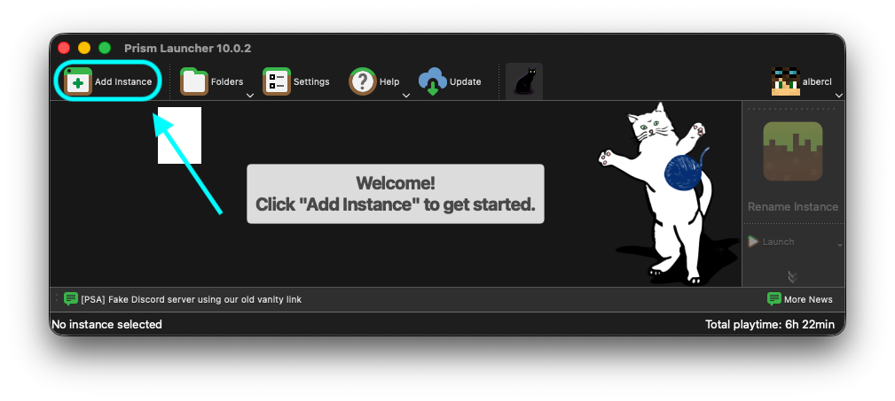
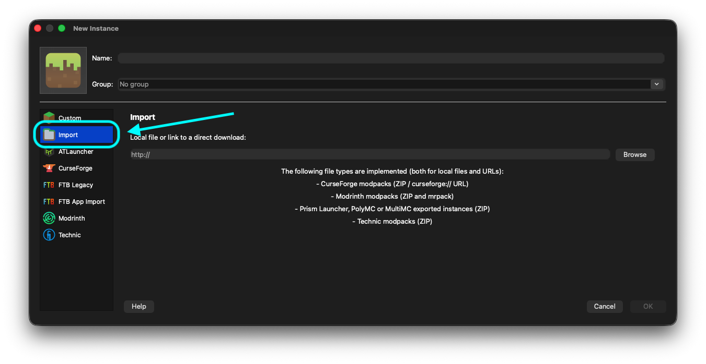
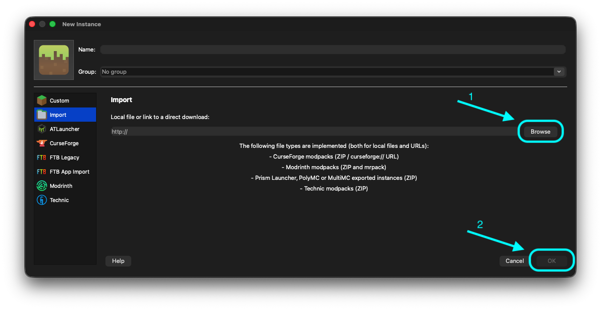

import { PUBLIC_GITHUB_RELEASE_URL } from 'astro:env/client';
import { LinkButton } from '@astrojs/starlight/components';

En esta página explicamos cómo descargar el modpack así como algunas recomendaciones adicionales.

## Descarga del modpack

Usamos el formato de Modrinth para la distribución del modpack (`.mrpack`). El primer paso para comenzar es descargar este archivo desde nuestro Github:

<LinkButton href={PUBLIC_GITHUB_RELEASE_URL} target="_blank" rel="noopener noreferrer" variant="secondary" icon="external" iconPlacement="start">
  Descargar el modpack (GitHub)
</LinkButton>

## Instalación de launcher compatible

Para instalar el modpack necesitarás un launcher de Minecraft que soporte la instalación de modpacks en formato Modrinth. **Recomendamos** usar uno de los siguientes:

<ul>
  <li><a href="https://prismlauncher.org/" target="_blank" rel="noopener noreferrer">(Premium) Prism Launcher</a>: Un launcher de código abierto y multiplataforma que soporta modpacks de Modrinth.</li>
  <li><a href="https://elyprismlauncher.github.io/" target="_blank" rel="noopener noreferrer">(No premium) Ely Prism Launcher</a>: Alternativa a Prism Launcher que permite jugar sin cuenta premium.</li>
</ul>

## Importar el modpack

Una vez tengas el launcher instalado, el siguiente paso es importar el modpack descargado:

1. Abre el launcher (Prism Launcher o Ely Prism Launcher) y selecciona la opción 'Añadir instancia'.

2. Selecciona la pestaña 'Importar'.

3. Haz clic en 'Seleccionar archivo' y elige el archivo `.mrpack` que descargaste previamente. Finalmente, pulsa OK.

4. El launcher importará el modpack y creará una nueva instancia. Una vez finalizado, haz doble click sobre la instancia para iniciar el juego.

5. La primera vez que inicies el modpack, el launcher descargará todos los mods y recursos necesarios. Esto puede tardar varios minutos dependiendo de tu conexión a internet. Podrás acceder al servidor con la IP `mc.albercl.dev`.