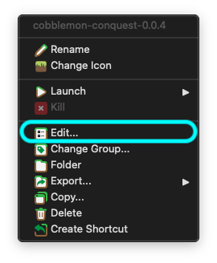
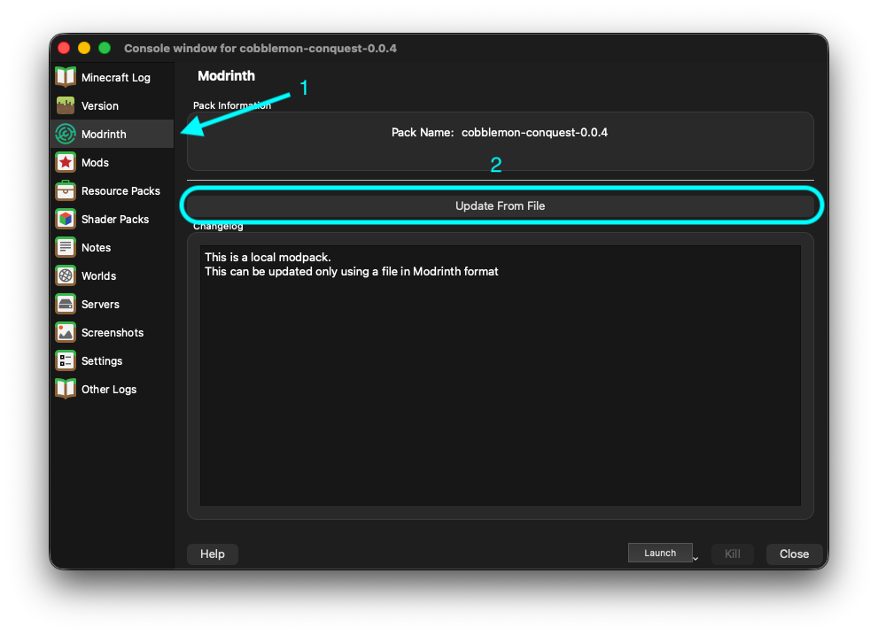

import { LinkButton } from '@astrojs/starlight/components';
import { PUBLIC_GITHUB_RELEASE_URL } from 'astro:env/client';

En esta página explicamos cómo actualizar el modpack para asegurarte de que tienes la última versión asegurando la compatibilidad con el servidor y accediendo a las últimas características y correcciones.

## Descarga de la última versión del modpack

Primero, necesitas descargar la última versión del modpack desde nuestro repositorio en GitHub:

<LinkButton href={PUBLIC_GITHUB_RELEASE_URL} target="_blank" rel="noopener noreferrer" variant="secondary" icon="external" iconPlacement="start">
  Descargar el modpack (GitHub)
</LinkButton>

## Actualización del modpack en el launcher

Para actualizar el modpack en tu launcher de Minecraft (Prism Launcher o Ely Prism Launcher), sigue estos pasos:

1. Abre el launcher y haz clic derecho sobre la instancia del modpack que deseas actualizar, luego selecciona "Editar".

2. En la ventana de edición de la instancia, ve a la pestaña "Modrinth". Luego selecciona "Actualizar desde archivo" y elige el archivo `.mrpack` que descargaste previamente. Finalmente, haz clic en "Aceptar" para iniciar la actualización.

3. Una vez terminado el proceso de actualización, inicia la instancia haciendo doble clic sobre ella.

4. ¡Sigue disfrutando de Cobblemon Conquest con la versión más reciente del modpack!